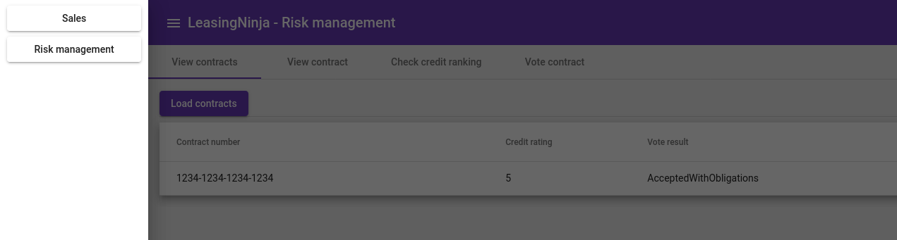

# LeasingNinja Frontend

This is a hacky frontend for the [LeasingNinja](https://leasingninja.github.io/). 
It does not follow any particular architecture or good coding style.
It uses the LeasingNinja API, so every backend adhering to this standard will be able to utilize this frontend.
It was initially written with the [implementation in Rust](https://github.com/Geigerkind/rusty_leasing_ninja) in mind.
The backend is expected to run on `localhost:8000`, providing the endpoints `/api/sales/view_contract/<contract_number>`, 
`/api/sales/sign_contract`, `/api/sales/fill_out_contract`, `/api/risk_management/contract/<contract_number>`, `/api/risk_management/contracts`, 
`/api/risk_management/rate` and `/api/risk_management/vote`. For implementation details consult the source code.

## How to run this frontend
1. Clone the project and go into the `frontend` directory.
2. Install the required packages using `npm i`.
3. Run it using the angular toolchain with `ng start`.
4. Visit the browser at `localhost:4200`. 